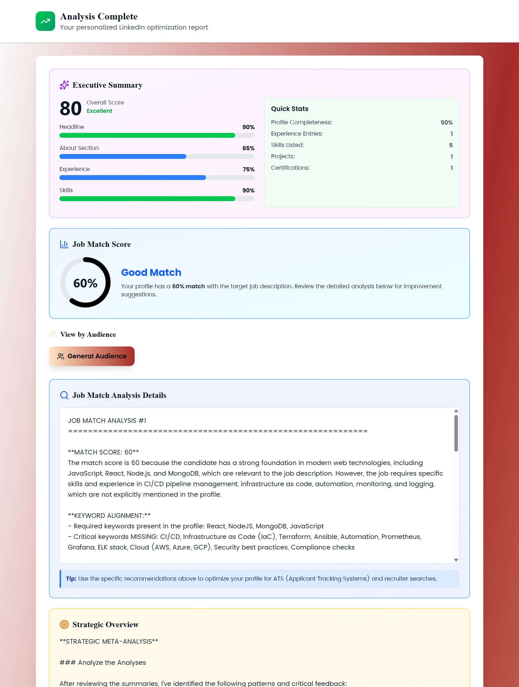

# **LinkedIn Profile Analyzer** 🚀

==================

_An emotionally intelligent AI partner that provides real-time, personalized feedback to elevate your professional brand and career narrative._

## Screenshots

### Home Page


### Target Audience Page


### Every Section is Filled


### Analysis



## Table of contents

1. Overview
2. Key Features
3. Architecture
4. AI Pipeline
5. Tech Stack
6. Getting Started
7. API Documentation
8. Contributing

## Overview

Tired of generic, superficial feedback on your LinkedIn profile? Existing tools often provide one-size-fits-all advice that fails to capture your authentic voice or address nuanced emotional tone. This leaves professionals with a static checklist instead of a dynamic strategy to truly stand out.

The LinkedIn AI Coach is a next-generation platform that transforms profile optimization from a static task into an ongoing, personalized, and emotionally intelligent coaching experience. It leverages a full-stack architecture to deliver deep, real-time analysis tailored to your specific career goals and target audience. The application analyzes every part of your profile to provide holistic, actionable insights that help you build a compelling professional narrative.

## Key features

- Real-time streaming analysis: Feedback is streamed from the FastAPI backend to the React UI as it's generated, providing an interactive and engaging user experience.
- Multi-persona targeting: Optimize your profile for different audiences (Recruiters, Hiring Managers, Potential Clients) and receive tailored advice for each.
- In-depth job match analysis: Paste a job description to get a detailed breakdown of your profile's alignment, including a match score and actionable keyword suggestions to get past applicant tracking systems (ATS).
- Advanced asynchronous backend: The Python backend uses asyncio to process multiple profile sections in parallel, with a custom stream merger to deliver results with maximum performance and efficiency.
- Strategic dual-model AI: For critical sections like the headline, the application uses a two-step process where one AI (Cerebras) generates creative options and a second AI (Llama 3) refines them for strategic impact.
- Polished, data-rich UI: The results dashboard features an executive summary, progress bars, persona comparison views, and collapsible sections to make the AI's insights clear and actionable.

## Architecture

This project uses a modern, decoupled full-stack architecture. The React frontend is separate from the FastAPI backend, communicating via API calls. This ensures a clean separation of concerns and allows independent scaling and development.

The application can be hosted with the frontend deployed to a static host (for example, Vercel) and the backend deployed as a FastAPI service (for example, Render). The backend communicates with external AI APIs to generate analysis and streams results to the frontend using Server-Sent Events (SSE).

```text
project-root/
├── .gitignore
├── README.md
├── requirements.txt
├── Backend/
│   ├── main.py             # FastAPI app entrypoint, defines API routes
│   ├── analysis.py         # Core AI analysis logic and prompting
│   ├── services.py         # Handles external API calls to Llama/Cerebras
│   ├── models.py           # Pydantic data models for validation
│   ├── utils.py            # Helper functions, like the async stream merger
│   ├── config.py           # Manages environment variables
│   └── .env.example        # Template for environment variables
└── frontend/
    └── src/
        ├── components/     # Reusable React components for each step of the UI
        ├── App.jsx         # Main React component, manages state and steps
        ├── main.jsx        # Entry point for the React application
        └── index.css       # Global styles and Tailwind CSS configuration
```

## AI pipeline

```text
[START] AI Analysis Pipeline
└── 📥 1. Profile Data Received by FastAPI Backend
    └── 🔄 2. Loop For Each Selected Persona (e.g., "Recruiter", "Client")
        ├── 🧠 3. Determine User Context & Strategy
        │   │   # A quick, non-streaming call to understand the user's seniority, industry, and goals.
        │   └── 🤖 AI Model: Cerebras
        │
        ├── ✍️ 4. Analyze Headline (Sequential Two-Step Process)
        │   │   # This unique process ensures both creativity and strategic relevance.
        │   ├── 💡 Step 4a: Generate 5 Creative Options
        │   │   └── 🤖 AI Model: Cerebras
        │   └── 🎯 Step 4b: Refine, Analyze, and Select Top 2 Options
        │       └── 🤖 AI Model: Llama 3.3 8B Instruct (Free) 
        │
        ├── 🚀 5. Analyze Core Sections in Parallel (Rate-Limited Batches)
        │   │   # Multiple sections are analyzed at once for speed, using a custom stream merger.
        │   ├── 📄 About Section (Llama 3.3 8B Instruct (Free) )
        │   ├── 📈 Experience Section (Cerebras)
        │   ├── 🎓 Education Section (Cerebras)
        │   ├── 🛠️ Skills, Projects, Certifications (Cerebras)
        │   └── ...
        │
        ├── 🎯 6. Conditional: Job Match Analysis (if enabled)
        │   │   # Analyzes the entire profile against provided job descriptions.
        │   └── 🤖 AI Model: Llama 3.3 8B Instruct (Free) 
        │
        ├── ✨ 7. Synthesize: Generate Holistic Feedback
        │   │   # A final meta-analysis that reviews all previous feedback for a strategic overview.
        │   └── 🤖 AI Model: Llama 3.3 8B Instruct (Free) 
        │
        └── 📤 8. Stream Finalized Persona Results to Frontend
            └── (Loop continues for the next persona...)
```

All Personas Analyzed

The backend follows a multi-step pipeline to generate a comprehensive analysis for each user. This pipeline is designed for both speed and strategic depth, using different AI models for the tasks they are best suited for.

## Tech stack

- Frontend: React (Vite), Tailwind CSS, Lucide React
- Backend: Python, FastAPI, Uvicorn
- AI APIs: Llama 3 (via OpenRouter), Cerebras AI
- Core libraries: httpx (async requests), pydantic (data validation), asyncio
- Deployment: Vercel (frontend), Render (backend)

Getting started
To run this project locally, you will need Python and Node.js installed on your machine.

## Prerequisites

- Python 3.8+
- Node.js v16+
- API keys for Cerebras and OpenRouter(Llama)

Installation and setup

1. Clone the repository and change into the project folder:

    ```powershell
    git clone [YOUR_REPOSITORY_URL]
    cd [PROJECT_FOLDER]
    ```

2. Backend: install dependencies and start the server

    ```powershell
    cd Backend
    pip install -r requirements.txt
    cp .env.example .env
    # Add your CEREBRAS_API_KEY and OPENROUTER_API_KEY to the .env file
    uvicorn main:app --reload
    ```

    The backend will be running on [http://localhost:8000](http://localhost:8000) by default.

3. Frontend: install dependencies and start the dev server

    ```powershell
    cd ../frontend
    npm install
    npm run dev
    ```

    The frontend will be running on [http://localhost:5173](http://localhost:5173) and will connect to the backend automatically.

## API documentation

The backend exposes two main endpoints for profile analysis.

1. _Streaming analysis_

- Endpoint: POST /analyze-stream
- Description: performs a real-time analysis and streams the results back to the client using Server-Sent Events (SSE).
- Request body: application/json matching the LinkedInProfile Pydantic model (see `Backend/models.py`).
- Response: text/event-stream where each event is a JSON object containing an analysis chunk.

   _Fallback (non-streaming) analysis_

- Endpoint: POST /analyze
- Description: performs the analysis and returns the complete result in a single JSON response.
- Request body: application/json matching the LinkedInProfile Pydantic model.
- Response: JSON matching the AnalysisResponse Pydantic model (see `Backend/models.py`).

## Contributing

This project was developed for _FutureStack GenAI_ hackathon hackathon. While contributions are not actively sought at this time, feel free to fork the repository and explore the code. For any major bugs or issues, please open an issue.

- Made to solve a real-world problem by **Anik Kumar Adhikary**
